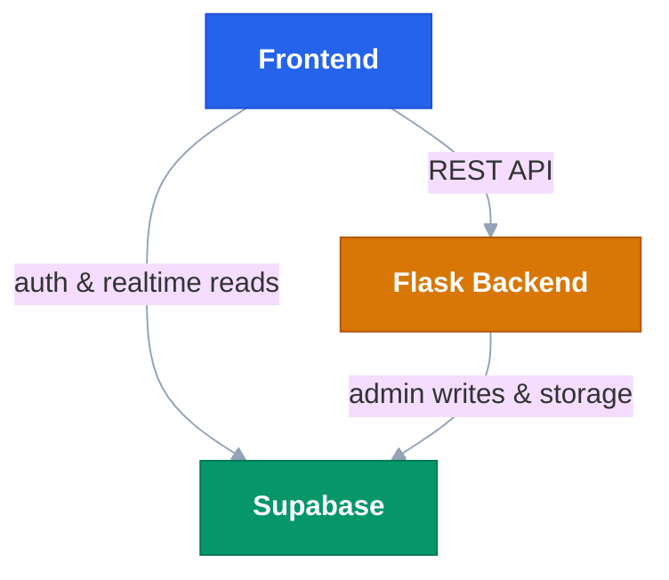

# Gradesphere-Showcase
GradeSphere is an AI-assisted grading platform for teachers working with open-ended, handwritten, and diagram-rich student submissions. It uses a retrieval-augmented generation pipeline to propose grades and written feedback per question, routes uncertain grades for mandatory teacher review, and learns from every teacher correction to improve accuracy over time.

---

## Table of Contents

- [Overview](#overview)
- [Architecture](#architecture)
- [Prerequisites](#prerequisites)
- [Environment Variables](#environment-variables)
- [Setup](#setup)
  - [Backend](#backend)
  - [Frontend](#frontend)
- [Running the Application](#running-the-application)
- [Features](#features)
  - [Teacher Interface](#teacher-interface)
  - [Student Interface](#student-interface)
  - [AI Grading Pipeline](#ai-grading-pipeline)
  - [Analytics and Insights](#analytics-and-insights)
  - [Canvas LMS Integration](#canvas-lms-integration)
  - [Privacy and Data Settings](#privacy-and-data-settings)
- [Backend API Reference](#backend-api-reference)
- [Frontend Routes](#frontend-routes)
- [Backend Dependencies](#backend-dependencies)
- [Frontend Dependencies](#frontend-dependencies)
- [Project Structure](#project-structure)

---

## Overview

GradeSphere addresses the grading burden in STEM education. Teachers with large cohorts and multi-step, open-ended assignments spend hours per assignment on repetitive evaluation tasks. GradeSphere proposes AI grades with written explanations for every question, flags uncertain grades for review, and learns from teacher overrides so that accuracy improves with use.

Key design decisions:

- All AI grades are proposals. Teachers review, override, and finalize every grade.
- A calibration gate prevents batch AI grading until the teacher has manually graded a minimum number of submissions, establishing a grading baseline the model can learn from.
- Confidence scoring routes grades automatically: those above the threshold are committed; those below are flagged as `needs_review`.
- Students receive written feedback per question and can contest any AI-assisted grade within a 14-day window.

---

## Architecture

The system has three layers: a React frontend, a Flask backend, and Supabase as the database and file storage layer. The grading pipeline runs entirely inside the Flask backend.



Supabase tables used:

| Table | Purpose |
|---|---|
| `courses` | Course records linked to teachers |
| `assignments` | Assignment metadata, rubric JSON, file paths |
| `submissions` | Student submission records and grading data |
| `grading_knowledge` | Teacher correction embeddings for auto-learn |

Supabase storage buckets:

| Bucket | Contents |
|---|---|
| `submissions` | Student-uploaded PDF files |
| `assignment_references` | Question paper and answer key PDFs |
| `vector_stores` | FAISS index files per assignment |

---

## Prerequisites

- Python 3.11
- Node.js 18 or later
- A Supabase project with the tables and buckets described above
- A Google Gemini API key (Gemini 2.0 Flash)
- A Canvas LMS API token (required only if using Canvas integration)

---

## Environment Variables

Do not commit `.env` files. Create them manually before running the application.

### Backend (`backend/.env`)

| Variable | Required | Description |
|---|---|---|
| `GEN_API` | Yes | Google Gemini API key |
| `VITE_SUPABASE_URL` | Yes | Supabase project URL |
| `SUPABASE_SERVICE_ROLE_KEY` | Yes | Supabase service role key (admin access, bypasses RLS) |
| `VITE_SUPABASE_ANON_KEY` | No | Supabase anon key (fallback if service role key is absent) |
| `CANVAS_API_KEY` | No | Canvas LMS API token (required for Canvas integration) |
| `CANVAS_API_URL` | No | Canvas instance URL, e.g. `https://canvas.instructure.com` |
| `GEMINI_MODEL` | No | Gemini model ID to use. Defaults to `gemini-2.0-flash` |
| `CALIBRATION_THRESHOLD` | No | Number of manual grades required before batch AI unlock. Defaults to `2` |
| `PORT` | No | Port for the Flask server. Defaults to `5001` |

### Frontend (`frontend/.env`)

| Variable | Required | Description |
|---|---|---|
| `VITE_SUPABASE_URL` | Yes | Supabase project URL |
| `VITE_SUPABASE_ANON_KEY` | Yes | Supabase anon key (used by the browser client) |
| `VITE_API_URL` | Yes | URL of the running Flask backend, e.g. `http://localhost:5001` |

---

## Setup

### Backend

```bash
cd backend
python -m venv .venv

# Windows
.\.venv\Scripts\activate

# macOS / Linux
source .venv/bin/activate

pip install -r requirements.txt
```

Create `backend/.env` with the variables listed above before starting the server.

### Frontend

```bash
cd frontend
npm install
```

Create `frontend/.env` with the variables listed above before starting the development server.

---

## Running the Application

Start the backend:

```bash
cd backend
python app.py
```

The backend runs on `http://localhost:5001` by default.

Start the frontend:

```bash
cd frontend
npm run dev
```

The frontend development server runs on `http://localhost:5173` by default.

For production, the backend can be served with Gunicorn:

```bash
gunicorn app:app
```

The frontend is built with:

```bash
npm run build
```

Output is placed in `frontend/dist/`.

---

## Features

### Teacher Interface

**Submissions List (`/teacher/assignment/:assignmentId/submissions`)**

- Filter submissions by status: All, Needs Grading, Needs Review, Contested, Graded
- Search by student name and sort by name, date, or score
- Status badges distinguish graded, needs_review, contested, and pending states
- Grading method badge shows whether a submission was graded manually, by AI, or by AI with teacher improvement
- Batch auto-grade modal with Safe Mode (auto-commits grades at or above the 0.60 confidence threshold) and Full Mode (grades all submissions regardless of confidence)
- Per-student selection with toggle-all for targeted batch grading
- PDF annotation option: when enabled, the AI renders sticky notes on student errors in the submission PDF
- Canvas sync buttons to import new submissions and push finalized grades back to Canvas
- Upload question paper and answer key PDFs to build the rubric and vector stores

**Grading Page (`/teacher/assignment/:assignmentId/submission/:submissionId`)**

- Question stepper tabs: amber when flagged `needs_review`, green when graded, grey when ungraded
- Confidence badge per question: "Confident" (score >= 0.60) or "Uncertain" (score < 0.60), with a tooltip explaining AI limitations
- Editable AI output: teachers can override score, explanation, last correct step, and error analysis
- Show/hide AI details panel for each question
- PDF annotation toggle enabling or disabling sticky notes during single-submission grading
- Contest banner displayed inline when a student has contested the grade, including the student's contest reason
- Auto-Grade button disabled until the calibration threshold is met

**Rubric Builder (`/teacher/assignment/:assignmentId/create-rubric`)**

- Build per-question rubrics with labelled score levels
- Upload question paper and answer key PDFs; the system extracts questions and solutions automatically using Gemini Vision
- Vector stores are built and uploaded to Supabase Storage on save

**Insights Page (`/teacher/assignment/:assignmentId/insights`)**

- Class average displayed in the page header
- Score distribution bar chart across grade bands (0-59, 60-69, 70-79, 80-89, 90-100)
- Topic performance horizontal bar chart showing class average by topic, with concept gaps flagged below 75%
- Class error heatmap: a question-by-score grid colour-coded green (>=80%), amber (>=50%), red (<50%)
- Individual performance list: ranked students with per-question scores benchmarked against the class median
- Integrity report: suspicious submission pairs flagged with similarity percentage, model alignment score, and reasoning

**Grading Queue (`/teacher/grading-queue`)**

- Consolidated view of submissions requiring attention across all assignments

**Students Page (`/teacher/students`)**

- Student roster view across courses

**Privacy and Data Settings (`/teacher/settings`)**

- Five active data policies with compliance status indicators
- Covers submission data retention (365 days after course end), AI processing transparency, data access controls, AI model data usage, and the grade contest and appeal policy
- FERPA compliance noted

### Student Interface

**Assignment Detail (`/student/course/:courseId/assignment/:assignmentId`)**

- AI transparency banner on every graded assignment: students are informed that their submission may be reviewed by AI and that all grades are subject to teacher review
- Per-question feedback panel showing score, explanation, last correct step, and error analysis
- Grade contest flow: students submit a written reason within the 14-day window; the submission status changes to `contested` and the reason is surfaced to the teacher
- Contest status banner shown after a contest is submitted

### AI Grading Pipeline

The grading pipeline is implemented in `backend/rag_grader.py` and `backend/pipeline_utils.py`.

**Rubric retrieval**

Per-question rubric levels are stored as FAISS vector index files in Supabase Storage. At grading time, the system loads the relevant index, queries it with the question content and a `question_id` filter, and retrieves the matching rubric levels as grounding context.

**Grading**

Retrieved rubric levels and any relevant teacher corrections from `grading_knowledge` are passed to Gemini 2.0 Flash along with the student answer (and image, if present). The model returns a structured JSON response containing score, explanation, last correct step, error analysis, and a rubric size indicator.

**Confidence scoring**

Four signals are combined into a weighted confidence score:

| Signal | Weight | Description |
|---|---|---|
| Rubric presence | 0.45 | 1.0 if 2+ rubric levels retrieved, 0.6 if 1, 0.0 if none |
| Teacher correction depth | 0.30 | Scaled by number of past corrections found (0-3+) |
| Answer substance | 0.15 | Based on answer length: blank = 1.0, short = 0.5, normal = 0.8, long = 0.7 |
| Diagram analysis | 0.10 | OpenCV confidence if a diagram is present; 0.5 (neutral) otherwise |

Scores are clamped to the range [0.10, 0.99]. Grades at or above 0.60 are auto-committed in Safe Mode; those below are flagged as `needs_review`.

**Auto-learn**

When a teacher saves a grade override, a background thread embeds the correction (question, teacher score, teacher explanation) using Sentence Transformers and stores it in the `grading_knowledge` table. Duplicate corrections for the same question are deduplicated by replacing the previous record. On subsequent grading runs, the top matching corrections are retrieved and passed to the model as primary reference material.

**Diagram processing**

OpenCV detects and classifies hand-drawn diagrams in submission images. The result, including diagram type and confidence, feeds into the grading prompt and contributes to the confidence score.

**PDF annotation**

When enabled, PyMuPDF renders the AI's error analysis as sticky note annotations directly onto the student's submission PDF, which is then re-uploaded to storage.

### Canvas LMS Integration

Canvas integration is implemented in `backend/canvas_integration.py` and exposed through the `/canvas/*` endpoints.

- Import course content: syncs courses, assignments, and associated rubrics from Canvas
- Import submissions: pulls student submission files and attachments from Canvas into Supabase Storage
- Import and export rubrics: bidirectional rubric sync between Canvas and GradeSphere
- Push grades: writes finalized GradeSphere grades back to Canvas gradebook

### Privacy and Data Settings

GradeSphere applies the following data handling policies:

- Submission files and grading data are retained for 365 days after the course end date, then permanently deleted
- Students are notified that their submissions may be processed by AI; all AI grades are reviewed and finalized by a human teacher
- Submission data is accessible only to the submitting student and the course teacher
- Student submissions are not used to train external AI models; AI grading uses retrieval-augmented generation over teacher-provided rubrics only
- Students may contest any AI-assisted grade within 14 days of release; contested grades are flagged for mandatory teacher review

---

## Backend API Reference

| Method | Endpoint | Description |
|---|---|---|
| GET | `/config` | Returns server-side configuration values including `calibration_threshold` |
| POST | `/extract-and-save-papers` | Downloads question and answer PDFs from storage, extracts questions and solutions via Gemini Vision, saves structured rubric to the assignment |
| POST | `/grade_batch` | Batch AI grading for an assignment; accepts `mode` (safe or full), optional `submission_ids` filter, and `enable_annotations` flag |
| POST | `/grade_submission` | Single-submission AI grading; accepts submission ID and `enable_annotations` flag |
| POST | `/submission/save_grade` | Saves a teacher-finalized grade and triggers auto-learn in a background thread |
| POST | `/submission/contest` | Records a student grade contest with reason text; sets submission status to `contested` |
| POST | `/promote_correction` | Manually triggers vectorization of a teacher correction into `grading_knowledge` |
| POST | `/canvas/import_course_content` | Syncs Canvas course content, rubrics, and file references into Supabase |
| POST | `/canvas/import_submissions` | Pulls Canvas student submissions and attachments into Supabase Storage |
| POST | `/canvas/import_rubric` | Imports a Canvas rubric into GradeSphere |
| POST | `/canvas/export_rubric` | Exports a GradeSphere rubric to Canvas (idempotent: creates or updates) |
| POST | `/canvas/sync_grades` | Pushes finalized grades from GradeSphere to the Canvas gradebook |
| GET | `/proxy_pdf` | Proxies PDF files from Supabase Storage or Canvas S3 URLs for in-browser viewing |

---

## Frontend Routes

| Path | Component | Description |
|---|---|---|
| `/` | HomePage | Landing page |
| `/auth/sign-in` | SignInPage | Authentication |
| `/auth/sign-up` | SignUpPage | Registration |
| `/student/dashboard` | StudentDashboard | Student home |
| `/student/course/:courseId` | CourseDetailsPage | Course overview for student |
| `/student/course/:courseId/assignment/:assignmentId` | AssignmentDetailsPage | Assignment view, feedback, and contest flow |
| `/teacher/dashboard` | TeacherDashboard | Teacher home |
| `/teacher/assignments` | ViewAssignmentsPage | All assignments list |
| `/teacher/courses` | CoursesPage | Course management |
| `/teacher/grading-queue` | GradingQueuePage | Cross-assignment review queue |
| `/teacher/students` | StudentsPage | Student roster |
| `/teacher/assignment/:assignmentId/submissions` | SubmissionsListPage | Submission management and batch grading |
| `/teacher/assignment/:assignmentId/create-rubric` | RubricBuilderPage | Rubric construction and PDF upload |
| `/teacher/assignment/:assignmentId/submission/:submissionId` | GradingPage | Per-submission grading interface |
| `/teacher/assignment/:assignmentId/insights` | InsightsPage | Assignment analytics |
| `/teacher/settings` | SettingsPage | Privacy and data policies |

---

## Backend Dependencies

All dependencies are listed in `backend/requirements.txt`. Python 3.11 is required.

| Package | Version | Purpose |
|---|---|---|
| `flask` | >=3.1 | Web framework |
| `flask-cors` | >=6.0 | Cross-origin request handling |
| `requests` | >=2.31 | HTTP client |
| `python-dotenv` | >=1.0 | Environment variable loading |
| `google-genai` | >=1.21 | Google Gemini API client |
| `langchain-community` | >=0.3.25 | FAISS vector store wrapper and HuggingFace embeddings adapter |
| `langchain-core` | >=0.3.60 | LangChain document types |
| `faiss-cpu` | >=1.7 | Vector similarity search |
| `sentence-transformers` | >=4.0 | all-MiniLM-L6-v2 embedding model |
| `numpy` | >=1.24 | Numerical operations |
| `PyMuPDF` | >=1.24 | PDF reading, rendering, and annotation |
| `opencv-python-headless` | >=4.8 | Diagram detection in submission images |
| `beautifulsoup4` | >=4.12 | HTML parsing for Canvas content |
| `supabase` | >=2.0 | Supabase Python client |
| `canvasapi` | >=3.0 | Canvas LMS REST API client |
| `python-dateutil` | >=2.8 | Date parsing for Canvas submission timestamps |
| `gunicorn` | >=21.2 | Production WSGI server |

---

## Frontend Dependencies

All dependencies are listed in `frontend/package.json`. Node.js 18 or later is required.

### Runtime Dependencies

| Package | Version | Purpose |
|---|---|---|
| `react` | ^19.0.0 | UI framework |
| `react-dom` | ^19.1.0 | React DOM renderer |
| `react-router-dom` | ^7.6.2 | Client-side routing |
| `@supabase/supabase-js` | ^2.49.4 | Supabase browser client |
| `tailwindcss` | ^4.1.11 | Utility-first CSS framework |
| `framer-motion` | ^12.38.0 | Animation library |
| `lucide-react` | ^0.525.0 | Icon set |
| `recharts` | ^3.1.0 | Chart components (used in Insights page) |
| `react-pdf` | ^10.0.1 | In-browser PDF rendering |
| `react-latex-next` | ^3.0.0 | LaTeX rendering in feedback text |
| `react-select` | ^5.10.2 | Searchable dropdown components |
| `react-hot-toast` | ^2.5.2 | Toast notifications |
| `react-toastify` | ^11.0.5 | Additional notification system |
| `tesseract.js` | ^4.1.1 | In-browser OCR |
| `uuid` | ^11.1.0 | UUID generation |
| `react-is` | ^19.1.1 | React type checking utilities |

### Development Dependencies

| Package | Version | Purpose |
|---|---|---|
| `vite` | ^6.2.6 | Build tool and development server |
| `@vitejs/plugin-react` | ^4.2.1 | Vite React plugin |
| `typescript` | ^5.7.3 | TypeScript compiler |
| `@tailwindcss/vite` | ^4.1.11 | Tailwind CSS Vite integration |
| `eslint` | ^8.57.0 | Linting |
| `@typescript-eslint/parser` | ^7.2.0 | TypeScript ESLint parser |
| `@typescript-eslint/eslint-plugin` | ^7.2.0 | TypeScript ESLint rules |
| `eslint-plugin-react-hooks` | ^5.2.0 | React hooks lint rules |
| `eslint-plugin-react-refresh` | ^0.4.18 | HMR lint rules |
| `vite-tsconfig-paths` | ^5.1.4 | TypeScript path alias support |

---
